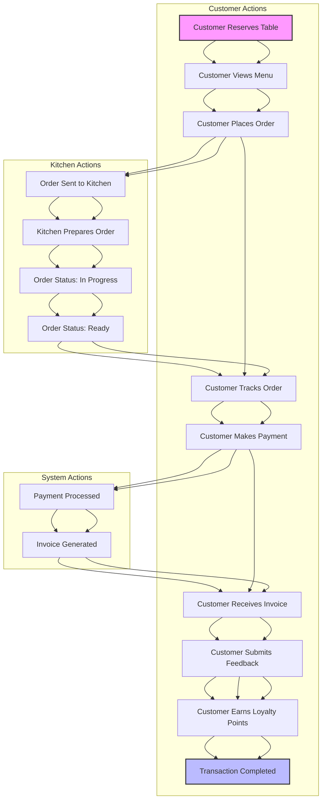

# Technical Specification Document for Restaurant Dine-In App

## 1. Introduction
This document outlines the technical specifications for a restaurant dine-in application designed to streamline table management, menu updates, order tracking, payment processing, and invoice generation. The app will be scalable, secure, and compliant with local regulations.

---

## 2. Objectives
- Enhance customer experience by reducing wait times and improving order accuracy.
- Streamline restaurant operations through efficient table and order management.
- Ensure data security and compliance with local regulations.
- Provide a scalable solution that can grow with the business.

---

## 3. Functional Requirements

### 3.1 Front-End Requirements
- **User Interface (UI):**
  - **Customer Interface:**
    - Table selection and reservation.
    - Interactive menu with categories, descriptions, and images.
    - Real-time order tracking.
    - Payment gateway integration.
    - Invoice generation and download.
    - Loyalty program integration (points system for repeat customers).
    - Feedback system for post-dining reviews.
  - **Staff Interface:**
    - Table management (assign, reassign, clear tables).
    - Menu management (add, update, delete items).
    - Order management (view, update, cancel orders).
    - Payment processing (cash, card, digital wallets).
    - Reporting and analytics dashboard.
    - Integration with third-party delivery services.

- **User Experience (UX):**
  - Intuitive navigation.
  - Responsive design for various devices (smartphones, tablets).
  - Accessibility features (e.g., screen reader support).
  - Multi-language support to cater to a diverse customer base.

---

### 3.2 Back-End Requirements
- **Database:**
  - **Tables:**
    - `Users` (Customers, Staff).
    - `Tables` (Table ID, Status, Capacity).
    - `Menu` (Item ID, Name, Description, Price, Category, Availability).
    - `Orders` (Order ID, Table ID, Items, Status, Timestamp).
    - `Payments` (Payment ID, Order ID, Amount, Method, Status).
    - `Invoices` (Invoice ID, Order ID, Details, PDF Path).
    - `Loyalty` (Customer ID, Points, Rewards).
    - `Feedback` (Feedback ID, Order ID, Rating, Comments).
  - **Relationships:**
    - One-to-Many: `Tables` to `Orders`.
    - One-to-Many: `Orders` to `Payments`.
    - One-to-One: `Orders` to `Invoices`.
    - One-to-Many: `Users` to `Loyalty`.
    - One-to-One: `Orders` to `Feedback`.

- **API Endpoints:**
  - **Customer Endpoints:**
    - `POST /reserve` (Table reservation).
    - `GET /menu` (Fetch menu).
    - `POST /order` (Place order).
    - `GET /order/{id}` (Track order).
    - `POST /payment` (Process payment).
    - `GET /invoice/{id}` (Generate invoice).
    - `POST /feedback` (Submit feedback).
    - `GET /loyalty` (Check loyalty points).
  - **Staff Endpoints:**
    - `POST /table` (Manage tables).
    - `POST /menu` (Manage menu).
    - `PUT /order/{id}` (Update order).
    - `GET /reports` (Fetch reports).
    - `POST /delivery` (Integrate with third-party delivery services).

- **Business Logic:**
  - Order lifecycle management.
  - Real-time updates using WebSockets.
  - Payment gateway integration (e.g., Stripe, PayPal).
  - Invoice generation using a PDF library (e.g., PDFKit).
  - Loyalty program logic (points calculation, rewards redemption).
  - Feedback collection and analysis.
  - Integration with third-party delivery APIs.

---

## 4. Non-Functional Requirements

### 4.1 Scalability
- **Horizontal Scaling:** Use load balancers and microservices architecture.
- **Database Scaling:** Implement sharding and replication.
- **Caching:** Use Redis or Memcached for frequently accessed data.

### 4.2 Security
- **Data Encryption:** Use HTTPS and encrypt sensitive data at rest.
- **Authentication:** Implement OAuth 2.0 and JWT for secure login.
- **Authorization:** Role-based access control (RBAC).
- **Compliance:** Ensure compliance with local data protection regulations (e.g., GDPR, CCPA).

### 4.3 Performance
- **Response Time:** Ensure API response times are under 200ms.
- **Uptime:** Aim for 99.9% uptime using redundant servers and failover mechanisms.

---

## 5. Order Lifecycle Flow Diagram

```plaintext
1. Customer reserves a table.
2. Customer views the menu and places an order.
3. Order is sent to the kitchen and updated in real-time.
4. Kitchen prepares the order and updates the status.
5. Customer tracks the order status.
6. Once the order is ready, customer makes a payment.
7. Payment is processed and an invoice is generated.
8. Customer receives the invoice and completes the transaction.
9. Customer submits feedback and earns loyalty points.



